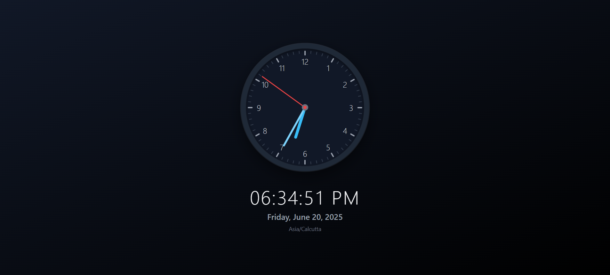

#  Wall Clock



A modern, responsive analog clock implementation built with React and TypeScript. The clock features a sleek 3D design with realistic shadows and modern UI elements.

## Features

- Real-time analog clock display
- Smooth hand movements for hours, minutes, and seconds
- Elegant design with shadows and depth effects
- Accessible UI with ARIA labels
- Responsive design

## Tech Stack

- React
- TypeScript
- Vite
- Tailwind CSS

## Getting Started

1. Install dependencies:
   ```bash
   npm install
   ```

2. Run development server:
   ```bash
   npm run dev
   ```

3. Build for production:
   ```bash
   npm run build
   ```

